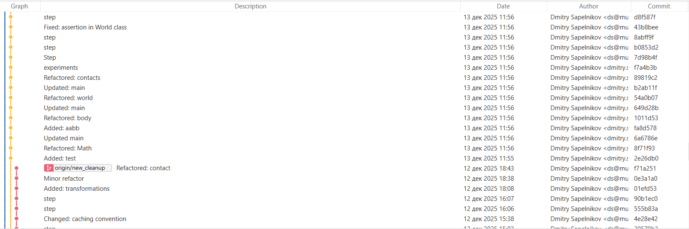

# Реализация задания
Исходники здесь:

https://github.com/dmitry-sapelnikov/neat-physics

Скомпилированная версия - в [./bin](bin)

В теории может потребоваться установка Visual C++ Redistributable v14: https://aka.ms/vc14/vc_redist.x64.exe

Управление:
- Нажатие на колесо мыши - перемещение
- Колесо мыши - зум
- Левая кнопка - добавление 1 коробки
- Правая кнопка - постоянное добавление коробок

Некоторые детали интерфейса:
- Параметр трения действует для **вновь созданных объектов**
- т.е. чтобы создать стены с ненулевым трением, вначале выставить трение, а затем
нажать **Reset**
- можно отключить V-Sync для добавления еще большего числа коробок
- можно снизить число итераций солвера, если повысить трение. Как ни странно,
именно нулевое трение делает систему гораздо более сложной для решения.
- в **Stats** есть статистика на максимальный interpenetration в сцене, и превышает ли он пороговое значение,
указанное в задании.

# Процесс разработки
Забегая вперед, то, что я сделал - явно перебор для задания.
В процессе работы фокус сместился с выполнения задания к "сделать физдвижок мечты, хотя бы начальную версию".
После бесконечного и беспробудного легаси на работе это стало хоть какой-то отдушиной.
В сумме было потрачено около 60 часов, включая 4 выходных c сессиями часов по 10.
Да, увы, жизни у меня помимо профессиональной деятельности в иммиграции практически нет.

Теперь изнанка.
## Начало, или Erin Catto наше всё
Первым делом я вспомнил о своем "старом знакомом", box2-lite, урезанной версии box2d:

https://github.com/erincatto/box2d-lite

Это был совершенно незаменимый источник знаний, когда я писал диплом.
К проекту помимо кода идет отличная презентация, на которой мое решение процентов на 90 и основано:

https://box2d.org/files/ErinCatto_SequentialImpulses_GDC2006.pdf

плюс немного из

https://box2d.org/files/ErinCatto_ModelingAndSolvingConstraints_GDC2009.pdf

Изначально был огромный соблазн просто отрефакторить оригинальный box2-lite,
но китайские пионеры легких путей не ищут, и был принят компромиссный вариант с совестью:
- математика и визуализация писались просто из головы, благо там ничего сложного нет
- коллижн и солвер писались по презентации, но тестировались по частям заменой соответствующей части в box2d-lite
затем все собиралось воедино уже в своем проекте

Должен признать, в код box2d-lite я естественно тоже заглядывал.
Из кода, взятого непосредственно из box2d-lite исходника, было лишь 2 участка и одна идея:

1. вычисление пересечения двух OOBB
```cpp
// NarrowPhase cpp, line 105
const Vec2 otherBoxProjections =
    abs(invRotations[bi] * centersVec) -
    absRelRotations[1 - bi] * halfSizes[1 - bi];

const Vec2 penetrations = halfSizes[bi] - otherBoxProjections;
```
Очень красивая формула без перебора разделяющих осей в цикле, 
и переноса этих осей в global frame плюс использующая факт,
что разделяющая ось должна образовывать острый угол.
Честно признаюсь, не знал о ней и не догадался бы самостоятельно.
Изначально я делал "классический" перебор проекций OOBB по 4 осям. Не удержался, заменил.

2. "тайный масонский знак" для narrow phase collision (мой вариант с 0-based индексированием)
```cpp
        e0
    v1 ---- v0
    |        |
 e1 |        | e3
    |        |
    v2 ---- v3
        e2
```
Имеется в оригинальной версии у Catto, когда реализовывал OOBB vs OOBB, понял, что без него никуда.
Без этой картинки перед глазами очень сложно индексировать вершины и ребра.

3. box2d-lite использует OpenGL 2.0, и я также решил срезать этот угол. Написать вершинный и фрагментный шейдер для OpenGL 3.1+ несложно, но было немного лень, использовать fixed function pipeline проще. И к заданию это особо не относилось.


## Больше коробок богу коробок
После наброски базового функционала началось "свободное плавание".

Я решил заменить bruteforce broadphase на sweep and prune, чтобы закрыть давний гештальт.
В университетском проекте я не сильно парился по поводу broadphase и также использовал bruteforce,
а в коммерческой разработке был взят dynamic AABB tree из box2d, зашаблонен на случай 2 и 3 измерений,
и с успехом использовался последние 10 лет. Sweep and prune же попадался на глаза много раз, но руки до него никак не доходили.
Когда я начал гуглить по теме этого алгоритма, с удивлением обнаружил, что по нему не было ни одной
статьи или туториала с "каноническим" решением, все интерпретировали алгоритм по-разному.
В итоге из удобоваримого и быстро читаемого нашлось это:

https://www.codeintuition.io/courses/array/NUf3OwGfR8mAFyUY7VxAh

https://leanrada.com/notes/sweep-and-prune-2

В итоге написал свою "истину в последней инстанции": на самом деле алгоритм достаточно простой.
Еще пробовал делать sweep по двум осям и мержить это при помощи `std::set_intersection`,
но это оказалось медленно из-за требуемых сортировок списка кандидатов. 
В итоге остановился на варианте с sweep-and-prune
по оси X и брутфорсовой проверке 2D пересечений в текущем наборе сегментов.
Кстати, изящный support mapping для OOBB, упомянутый выше, пригодился и здесь,
уже для вычисления AABB вокруг OOBB.

Также получилось прилично оптимизировать обновление `unordered_map`-а контактных пар,
введя флаг устаревания, а не выискивая пары непосредственно в `map`-е.

## Программисты игровой физики дуреют с этой архитектуры
Следующим этапом было сделать наконец-то "всё как положено" в плане архитектуры.
Очень хотелось разделить подсистему collision detection и солвера, обычно в физдвижках
об этом особо не думают, и collision detection генерирует не просто точки контакта,
а именно contact constraints, т.е. обладает ненужным знанием о том, для чего результаты ее работы
применяются.

В итоге после переделки я сделал 2 параллельные "иерархии":
- `CollisionPoint` (точка пересечения между 2 геометриями)
- `CollisionManifold` (набор точек, аппроксимирующий объем пересечения)
- `CollisionSystem`

и

- `ContactPoint` (constraint, представляющий 1 точку контакта)
- `ContactManifold` (constraint, представляющий пятно контакта)
- `ContactSolver`

Плюс перенес расчет импульсов из `ContactSolver` в `ContactPoint`.

Была также попытка раздробить сущности еще сильнее, и добавить класс
`Constraint`, представляющий 1 строку матрицы Якоби, и собрать `ContactPoint`
как композицию 2 `Constraint`, но код получился более сложным для понимания, плюс просела производительность,
потому что компилятор не смог заинлайнить часть функций.

## Расчистка Авгиевых конюшен
К концу экспериментов "творческий беспорядок" выглядел так:


В добавок ко всему изначально я назвал проект box2nano (ну и namespace имел соответствующее имя),
желая сделать что-то еще более компактное, чем box2d-lite, но получилось как в старой шутке
"взвесьте только 200г конфет - получилось полкило - а давайте".
`cloc` выдал 900 строк кода в box2d-lite и 1400 в моей "Роснане". Т.е. название стало мягко говоря неактуальным.

В итоге решил переименоваться в текущее название, сделал копию репозитория, reset почти на начальный коммит,
где я только набросал прототип testbed-а, и начал чистить и накатывать файлы по одному, попутно меняя namespace, затем сделал репу на GitHub и перемотал
локальную репу туда.

## Финальные штрихи
Заменил Baumgarte stabilization для position correction на position-based,
подсмотренный в box2d:

https://github.com/erincatto/box2d/blob/411acc32eb6d4f2e96fc70ddbdf01fe5f9b16230/src/dynamics/b2_contact_solver.cpp#L676C1-L676C49

Плюс добавил параметры для контроля почти всего в тестовой сцене.

Также попробовал split impulses вместо position-based, но они плохо работают именно для сцен с нулевым трением.
Если есть желание потестировать, можно посмотреть ветку:
https://github.com/dmitry-sapelnikov/neat-physics/tree/split_impulse

# Мысли о результате
## Что мне понравилось самому
1. Разграничение подсистем коллизий и динамики (пока не совсем полное, т.к. collision system пока знает о телах, но это несложно будет исправить используя ECS, см. ниже)
2. Использование contiguous-memory контейнеров для лучшей cache friendliness, единственная на данный момент "паршивая овца" - `unordered_map` для contact manifolds. Да, я ввел ограничение на преаллокацию тел в `World`, но, как мне кажется, это того стоило, плюс не очень сложно добавить алгоритм для ремаппинга указателей на тела, если вдруг всё же потребуется снять ограничение.
3. Применение структур с immutable members для соблюдения ограничений вместо классов с getter/setter-ами. Просто эксперимент, до этого никогда не использовал. Выглядит лаконично, но имеет свои ограничения.

## Что нужно улучшать
1. Скорее всего отказаться от sweep and prune, надо потестировать dynamic AABB tree из box2d в текущем проекте, если окажется быстрее - написать свой на его основе.
2. Каким-то образом избавиться от `unordered_map` вовсе, как минимум - использовать ее лишь для dispatch-а, но не для хранения contact manifolds,
т.к. по ним мы очень много итерируемся во время решения контактов, и это наверняка приводит к cache miss-ам, т.к. они не размещены непрерывно в памяти. Как вариант можно попробовать кастомный аллокатор.
3. Поглубже покопаться в причине, почему velocity constraints в box2d решаются немного лучше, чем у меня, даже при равных начальных условиях. Код вроде бы такой же, банальный projected Gauss-Seidel, но есть какое-то отличие.
4. Полноценно использовать entity-component-system архитектуру: "распилить" твердые тела на компоненты массы, позиции, скорости и т.д. 
Должно финально разграничить collision и dynamics системы, также улучить cache friendliness за счет того, что данные для коллизий и солвера будут упакованы компактнее в памяти.
5. Добавить границы мира, удалять / останавливать тела при достижении этих границ.
6. Добавить балансировку числа итераций солвера при хорошей сходимости.

## Спорные моменты
1. Осознанное отсутствие инициализации полей структур наподобие `Vec2`. Код с таким подходом работает примерно на 5% быстрее в текущих тестах, но естественно гораздо опаснее.
2. Добавление абстракции `Plane`: без нее можно легко обойтись, но лично мне было комфортнее писать коллижн так.
3. "Волшебная" модулярная арифметика в narrow phase вроде `(pointIndex + 3 - 3 * fi) % 4`. Я такое ой как люблю, но понимаю, что буду сам это с трудом понимать спустя буквально пару недель.

# Обратная связь
Вопросы, комментарии, багрепорты и конструктивная критика очень и очень приветствуются.
Если есть желание, можно созвониться и сделать код ревью.
